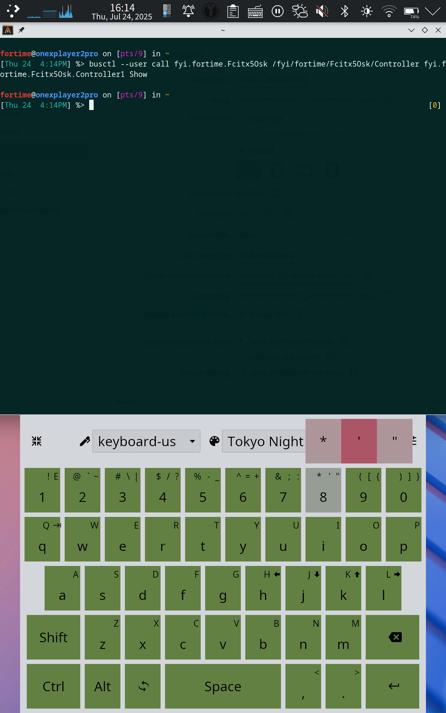

# Fcitx 5 Osk

## Description

Fcitx 5 Osk is an on-screen keyboard designed to work with Fcitx 5. It provides a virtual keyboard for inputting text across various environments.

***I have only test it on kwin6 wayland/xwayland.***

* landscape view


* portrait view


## Features

* Works under various Wayland compositors and X11 (tested only in XWayland).
* Communicates with Fcitx 5 via `dbus` for key press events.
* Can be used on the KDE lock screen and login screen (SDDM) with the help of Fcitx 5 Osk Kwin Launcher.
* Support rotation detection, and use different layouts for landscape and portrait orientations.
* Support custom layouts and keys.
* Support theming.
* Support dock and float mode.

## Fcitx 5 Osk Kwin Launcher

Fcitx 5 Osk Kwin Launcher is a critical component that enables Fcitx 5 Osk to function properly on the KDE lock screen and login screen. It initializes Fcitx 5 Osk based on the current context:

* **After login or unlock:** Starts Fcitx 5 with `WAYLAND_SOCKET` and launches Fcitx 5 Osk in normal mode.
* **On the unlock screen:** Starts Fcitx 5 Osk with `WAYLAND_SOCKET` and toggles it based on the KWin virtual keyboard visibility signal. In both the unlock and login screens, only surfaces created with `zwp_input_panel_v1` can be shown. Therefore, Fcitx 5 Osk must be launched with `WAYLAND_SOCKET` and communicate directly with KWin using `zwp_input_method_v1`.
* **On the login screen (SDDM):** Starts with the `--sddm` option, skipping communication with the FDO service (which is not yet available). Fcitx 5 Osk behaves similarly to how it does on the unlock screen.

## Fcitx 5 Osk Key Helper

Since fcitx5 doesn't forward modifier events correctly on Wayland, uppercase letters cannot be input. I have summitted a [PR fcitx/fcitx5#1292](https://github.com/fcitx/fcitx5/pull/1292), but it looks like it won't be merged. So, I came up a workaround: create a keyboard with evdev and use this keyboard to handle modifier events. This is what `fcitx5-osk-key-helper` does.

### Caveat

Creating a keyboard with evdev requires root privileges, and it may not be safe to expose a universal keyboard D-Bus API to user space. Therefore, fcitx5-osk-key-helper will handle modifier keycodes by default.

## Build and Installation

### Arch Linux

Packages are available in the AUR: [fcitx5-osk-git](https://aur.archlinux.org/packages/fcitx5-osk-git) and [fcitx5-osk-kwin-launcher-git](https://aur.archlinux.org/packages/fcitx5-osk-kwin-launcher-git).

### Manual

* build
```bash
cmake -B build -S .
cmake --build build
```

* install

```bash
cmake --install build --component Fcitx5Osk

# install kwin launcher
cmake --install build --component Fcitx5OskKwinLauncher
```

## Usage

### Enable Fcitx5 Osk Key Helper

```bash
# enable and start
sudo systemctl enable --now fcitx5-osk-key-helper
```

### Use without Fcitx5 Osk Key Helper

You can use a patched `fcitx5` and add/set `modifier_workaround_keycodes` in `${HOME}/.config/fcitx5-osk/config.toml` to empty.
```toml
modifier_workaround_keycodes = []
```

### Kwin (Wayland)

To enable Fcitx 5 Osk Kwin Launcher:
Go to **System Settings** → **Keyboard** → **Virtual Keyboard**, and select **"Fcitx 5 Osk Kwin Launcher"**.

### SDDM

Add the input method option with the value `"fcitx5-osk-kwin-launcher --sddm"` to `kwin_wayland`.
Here is an example configuration file:

```ini
# /etc/sddm.conf.d/rootless.conf
[General]
DisplayServer=wayland
GreeterEnvironment=QT_WAYLAND_SHELL_INTEGRATION=layer-shell

[Wayland]
CompositorCommand=kwin_wayland --drm --no-lockscreen --no-global-shortcuts --locale1 --inputmethod "fcitx5-osk-kwin-launcher --sddm"
```

* For a maunal build, `/usr/local/bin` might not be in `$PATH` of the process of `SDDM`, use the absolute path of `fcitx5-osk-kwin-launcher`:

```ini
# /etc/sddm.conf.d/rootless.conf
[General]
DisplayServer=wayland
GreeterEnvironment=QT_WAYLAND_SHELL_INTEGRATION=layer-shell

[Wayland]
CompositorCommand=kwin_wayland --drm --no-lockscreen --no-global-shortcuts --locale1 --inputmethod "/usr/local/bin/fcitx5-osk-kwin-launcher --sddm"
```

### Open Keyboard Manually

A key event from a keyboard of evdev will make `fcitx5` to hide a virtual keyboard. If the indicator is set to be `AlwaysOff`, and you want to open the keyboard. You can use this command.

```bash
fcitx5-osk force-show
```

Or you can click "Fcitx 5 Osk" in the application menu directly. You can add a quick launcher in the panel too.

### Custom Layouts, Keys and Themes

You can create your own layouts, keys and themes, and specify the layout to be used in a specified input method. Keys are organized by a key set.

* By default, `fcitx5-osk` will search toml files in 'fcitx5-osk/layouts', 'fcitx5-osk/key\_sets' and 'fcitx5-osk/themes' under `$XDG_CONFIG_DIRS` and `$XDG_CONFIG_HOME`. If `$XDG_CONFIG_HOME` is not set, `$HOME/.config` will be used. If there are multiple config has the same name, the latter one has higher priority.

* Set the layout to be used 
```toml
# Layouts to be used in landscape view. If no layout is specified for an input method, the builtin one will be used.
[im_layout_mapping.landscape]
# custom-layout-for-rime-landscape is the name of the layout. rime is the input method name. You can find it in the input method drop-down list of `fcitx5-osk`.

rime = "custom-layout-for-rime-landscape"

# Layouts to be used in portrait view. If no layout is specified for an input method, the builtin one will be used.
[im_layout_mapping.portrait]
# custom-layout-for-rime-portrait is the name of the layout. rime is the input method name. You can find it in the input method drop-down list of `fcitx5-osk`.
rime = "custom-layout-for-rime-portrait"
```

#### Layout Toml File

You can copy and edit the [builtin layout](assets/layouts/default-landscape.toml) to create your own. Here are some explanations:

```toml
# The name of the layout, it should be unique globally.
name = "Some Unique Name"

# The space between each row.
spacing = 1

# A row of the keys, the length or the width is a number of unit. The unit will be dynamic calculated.
[[elements]]
# The height of this row.
height = 6
# The space between each element of the row.
spacing = 1
# There are two kinds of element in a row: key and padding. A key is a name starting with 'k' and a padding is 'p'. You can specify the width of the element with ':number'. By default, the width of a key is 8, and the width of a padding is 1.
elements = ["p:3", "k21", "k22", "k23", "k24", "k25", "k26", "k27", "k28", "k29:12", "p:3"]

# Specify which key is to be used
[key_mappings]
# If no key set is specify, it will be found in the builtin one.
k21 = "k_grave_accent"
# k_grave_accent from a key set named "custom_key_set"
k22 = "custom_key_set:k_grave_accent"
```

#### Key Set Toml File

You can copy and edit the [builtin key set](assets/key_sets/default.toml) to create your own. Here are some explanations:
```toml
# The name of the key set, it should be unique globally.
name = "Some Unique Name"

# Specify "k_escape"
[keys.k_escape]
# The primary form: keysym is 0xff1b, symbol to be shown is "Esc", keycode(x11 variant) is 9
p = {ks = 0xff1b, s = "Esc", kc = 9}

# Specify "k_p_four"
[keys.k_p_four]
# The primary form: character is '4' (symbol and keysym will be generated by the character automatically), keycode(x11 variant) is 13
p = {c = "4", kc = 13}
[[keys.k_p_four.s]]
# The first secondary form: character is '$', keycode(x11 variant) is -13 (Negative keycode means shift should be pressed)
c = "$"
kc = -13
[[keys.k_p_four.s]]
# The second secondary form: character is '/', keycode(x11 variant) is 61
c = "/"
kc = 61
[[keys.k_p_four.s]]
# The third secondary form: character is '?', keycode(x11 variant) is -61
c = "?"
kc = -61
```

#### Theme Toml File

Here is an example.

```toml
name = "Breeze Light"

[palette]
background = "#ffffff"
text = "#232629"
primary = "#3daee9"
success = "#27ae60"
danger = "#da4453"

# This is the extended palette for advanced settings
[extended_palette]
is_dark = false

[extended_palette.background.base]
color = "#ffffff"
text = "#232629"
[extended_palette.background.weak]
color = "#ffffff"
text = "#232629"
[extended_palette.background.strong]
color = "#ffffff"
text = "#232629"

[extended_palette.primary.base]
color = "#ffffff"
text = "#232629"
[extended_palette.primary.weak]
color = "#ffffff"
text = "#232629"
[extended_palette.primary.strong]
color = "#ffffff"
text = "#232629"

[extended_palette.secondary.base]
color = "#ffffff"
text = "#232629"
[extended_palette.secondary.weak]
color = "#ffffff"
text = "#232629"
[extended_palette.secondary.strong]
color = "#ffffff"
text = "#232629"

[extended_palette.success.base]
color = "#ffffff"
text = "#232629"
[extended_palette.success.weak]
color = "#ffffff"
text = "#232629"
[extended_palette.success.strong]
color = "#ffffff"
text = "#232629"

[extended_palette.danger.base]
color = "#ffffff"
text = "#232629"
[extended_palette.danger.weak]
color = "#ffffff"
text = "#232629"
[extended_palette.danger.strong]
color = "#ffffff"
text = "#232629"
```

## Troubleshoot

### `GTK_IM_MODULE` and `QT_IM_MODULE` are set

With `QT_IM_MODULE` set, the virtual keyboard won't be shown in the SDDM login screen and the KDE lock screen. In a distribution with `im-config` installed, like Debian 13, it will set `*_IM_MODULE` by default. You can set `IM_CONFIG_DEFAULT_MODE` to `none` in `/etc/default/im-config`.

## Issues

* [PR fcitx/fcitx5#1292](https://github.com/fcitx/fcitx5/pull/1292) is needed to input correctly in latin mode of Fcitx 5.
* [iced\_layershell](https://github.com/waycrate/exwlshelleventloop) is patched. All patches has been upstreamed. But it is waiting for the release of iced 14.

## TODO

* [ ] integrated with xcbcommon.
* [ ] iced 14 and add `RefreshRequest` for our widgets.
* [ ] use `RefreshRequest` to implement long press event?
* [ ] support custom theme
* [ ] support custom shape of key
* [ ] support repeat key mode?
